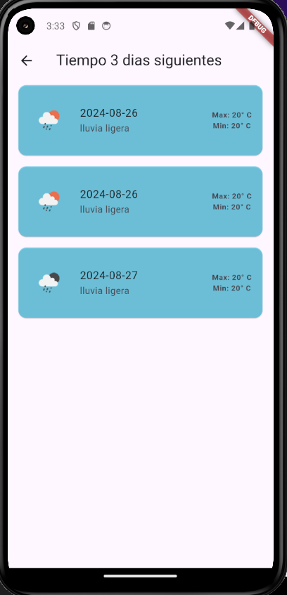

# Clima APP

La aplicación proporciona información meteorológica actualizada en tiempo real basada en la ubicación del usuario o en una ubicación seleccionada manualmente.

1. Instalar Flutter
Primero, asegúrate de tener Flutter instalado en tu sistema.

Instrucciones para Instalar Flutter:
Flutter Setup Guide
Dependiendo de tu sistema operativo (Windows, macOS o Linux), sigue los pasos para instalar Flutter.

2. Instalar un Editor de Código
Te recomiendo usar Visual Studio Code. 

Descargar Visual Studio Code
Descargar Android Studio
3. Configurar el Editor de Código
Instala las extensiones necesarias para Flutter en tu editor:

VS Code: Busca e instala la extensión Flutter desde el Marketplace.

Android Studio: Instala el plugin Flutter desde el menú Plugins.

4. Configurar un Emulador
Puedes ejecutar la aplicación en un dispositivo físico o en un emulador.

Crear un Emulador en Android Studio:
Abre Android Studio.
Ve al menú AVD Manager (Herramienta del dispositivo virtual Android).
Crea un nuevo emulador configurando el dispositivo y la versión de Android que desees.
Inicia el emulador.
Conectar un Dispositivo Físico:
Conecta tu dispositivo Android mediante USB.
Activa las opciones de desarrollador en tu dispositivo.
Habilita depuración USB en las opciones de desarrollador.

5. Clonar o Descargar el Código
Clona tu repositorio de GitHub o copia tu código en un directorio local.

6. Instalar Dependencias
Una vez tengas el código en tu máquina, instala las dependencias del proyecto Flutter.

Instrucciones:
Abre una terminal en el directorio raíz del proyecto.

Ejecuta el siguiente comando:
bash 
flutter pub get
Esto instalará todas las dependencias necesarias que están especificadas en el archivo pubspec.yaml.

7. Configurar API Keys
Asegúrate de configurar las claves de API necesarias para que el pronóstico del clima funcione.

Instrucciones:
Ve al archivo donde estás usando la API de OpenWeather (por ejemplo, Const.dart).
Asegúrate de tener una clave de API válida de OpenWeather.
Asigna la clave a la constante OPENWEATHER_API_KEY.
dart
Copiar código
const String OPENWEATHER_API_KEY = 'TU_API_KEY';

para este caso no es necesario ya que ya a sido agregada. 

7. Ejecutar la Aplicación

sigue estos pasos:

Abre una terminal en el directorio del proyecto.
Asegúrate de que el emulador esté en ejecución o que tu dispositivo esté conectado.

Ejecuta el siguiente comando:
bash 
flutter run
Esto compilará la aplicación y la ejecutará en el emulador o dispositivo conectado.

capturas de Clima APP 

Pantalla Principal de la App de Clima

Información Clave del Clima:

La pantalla principal te da toda la info importante sobre el clima y el tiempo de inmediato. Ahí verás dos menús desplegables (dropdowns) donde puedes elegir el idioma y el país del que quieres saber el clima.

Ubicación Inicial:

La app usa el GPS para saber dónde estás y automáticamente configura el país de inicio basado en tu ubicación actual.

Datos del Clima:

La pantalla muestra tu ubicación actual, la hora, el icono del clima y una descripción con la temperatura general. También verás un botón que te lleva a información extra.

Información Adicional:

Al hacer clic en el botón de información extra, la app te lleva a otra pantalla que muestra detalles adicionales como la temperatura máxima y mínima, la velocidad del viento y la humedad.

Botón de Actualización:

Finalmente, hay un botón para actualizar la información del clima, para que siempre tengas los datos más recientes.

captura tomada del emulador funcionando app en 2 dispositivos con caracteristicas distintas:

Segunda Pantalla: Pronóstico del Clima

Pronóstico a Tres Días:

En esta pantalla, puedes ver cómo estará el clima durante los próximos tres días. Aquí te mostramos la temperatura máxima y mínima de cada día, junto con una descripción del clima y un ícono que representa las condiciones.

captura tomada del emulador funcionando app en 2 dispositivos con caracteristicas distintas:

